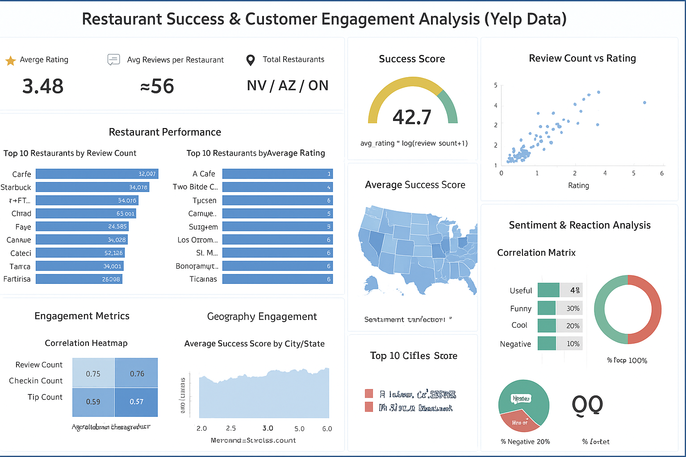

# **Customer Churn Prediction and Retention Strategy**

##  Overview
This project analyzes Yelp restaurant data to identify key factors influencing customer churn and develop data-driven retention strategies. Using real user engagement and sentiment signals, the analysis combines statistical methods, machine learning, and visualization to uncover actionable insights for improving restaurant success and customer loyalty.

---

##  Business Problem
In a competitive restaurant market, customer attrition (churn) directly impacts profitability. The goal is to:
- Predict which restaurants are at risk of losing customers.  
- Understand engagement and sentiment drivers behind churn.  
- Design retention strategies based on behavior, ratings, and time trends.

---

##  Dataset
The data comes from the **Yelp Open Dataset**, focusing on restaurant-type businesses.  
It includes five JSON files:
1. **business.json** – Restaurant details (location, ratings, review counts)  
2. **review.json** – User reviews, ratings, sentiment, and reactions  
3. **user.json** – User attributes (elite status, review count, followers)  
4. **checkin.json** – Customer check-ins by time/date  
5. **tip.json** – User tips and likes for restaurants  

After cleaning, these were integrated into a unified analytical dataset stored in SQLite.

---

##  Tools & Technologies
**Languages & Libraries:** Python, pandas, NumPy, matplotlib, seaborn, scikit-learn, sqlite3, nltk  
**Visualization:** Power BI, Matplotlib, Seaborn  
**Storage:** SQLite Database  
**Modeling:** Logistic Regression, Random Forest (for churn prediction)  
**Environment:** Jupyter Notebook  

---

##  Project Structure
```
customer_churn_prediction_yelp/  
│  
├── data/ # raw, interim, processed data  
├── notebooks/ # Jupyter notebooks for each phase  
├── src/ # modular Python scripts  
├── reports/ # plots, dashboards, and final PDF  
├── models/ # saved ML models and metrics  
├── scripts/ # automation scripts  
└── README.md
```

---

##  Data Cleaning & Preparation
- Filtered active/open restaurant businesses.  
- Removed missing or inconsistent entries (business_id, stars, review_count).  
- Aggregated engagement metrics (reviews, tips, check-ins).  
- Generated sentiment scores from review text.  
- Merged datasets into a relational structure using SQLite.  
- Engineered churn label based on business activity trends.

---

##  Exploratory Data Analysis (EDA)
EDA examined:
- Correlation among reviews, check-ins, and tips.  
- Sentiment vs. rating trends.  
- Temporal patterns (COVID impact, seasonality, busy hours).  
- City-wise success and engagement levels.  
- Elite user influence on business retention.

---

##  Research Questions & Key Findings
**1. Does higher engagement predict success?**  
 Yes — engagement across reviews, tips, and check-ins is tightly correlated.  

**2. Do high ratings guarantee retention?**  
 No — 4★ restaurants often show the most stable engagement; 5★ can plateau.  

**3. Which cities perform best?**  
 Philadelphia, Tampa, Indianapolis, and Tucson lead in engagement and retention.  

**4. What signals predict churn?**  
 Drop in review/check-in activity, loss of elite users, and negative sentiment.  

**5. What are the busiest times?**  
 Evenings (4 PM–1 AM) and winter months (Nov–Mar) show peak engagement.  

---

##  Dashboard
An interactive **Power BI Dashboard** visualizes:
- Engagement and churn trends by city and time.  
- Correlation between ratings, sentiment, and check-ins.  
- Churn probability predictions and retention levers.  

**File:** 



---

##  How to Run This Project
1. **Clone the repository:**
   ```bash
   git clone https://github.com/yourusername/customer_churn_prediction_yelp.git
   cd customer_churn_prediction_yelp

---

## Data Cleaning & Preparation
- Filtered active/open restaurant businesses.  
- Removed missing or inconsistent entries (business_id, stars, review_count).  
- Aggregated engagement metrics (reviews, tips, check-ins).  
- Generated sentiment scores from review text.  
- Merged datasets into a relational structure using SQLite.  
- Engineered churn label based on business activity trends.

---

##  Exploratory Data Analysis (EDA)
EDA examined:
- Correlation among reviews, check-ins, and tips.  
- Sentiment vs. rating trends.  
- Temporal patterns (COVID impact, seasonality, busy hours).  
- City-wise success and engagement levels.  
- Elite user influence on business retention.

---

##  Research Questions & Key Findings
**1. Does higher engagement predict success?**  
 Yes — engagement across reviews, tips, and check-ins is tightly correlated.  

**2. Do high ratings guarantee retention?**  
 No — 4★ restaurants often show the most stable engagement; 5★ can plateau.  

**3. Which cities perform best?**  
 Philadelphia, Tampa, Indianapolis, and Tucson lead in engagement and retention.  

**4. What signals predict churn?**  
 Drop in review/check-in activity, loss of elite users, and negative sentiment.  

**5. What are the busiest times?**  
 Evenings (4 PM–1 AM) and winter months (Nov–Mar) show peak engagement.  

---

##  Dashboard
An interactive **Power BI Dashboard** visualizes:
- Engagement and churn trends by city and time.  
- Correlation between ratings, sentiment, and check-ins.  
- Churn probability predictions and retention levers.  

**File:** `/reports/dashboards/churn_retention.pbix`

---


#### Final Recommendations

-   **Monitor engagement metrics monthly** to detect churn early.
    
-   **Leverage elite users** through loyalty programs and recognition.
    
-   **Optimize staffing and promotions** around evening hours.
    
-   **Replicate best-performing city strategies** across lower-performing regions.
    
-   **Integrate sentiment tracking** into regular customer feedback systems.

###  Author & Contact
**Author:** Mohd .Moinuddin  
**Role:** Data Analyst | Machine Learning Enthusiast  
**Contact:** [moinuddinn012@gmail.com]  


